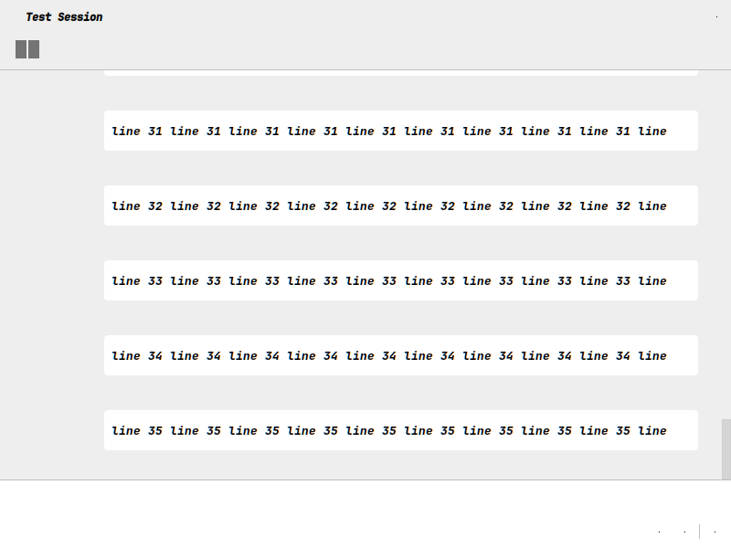
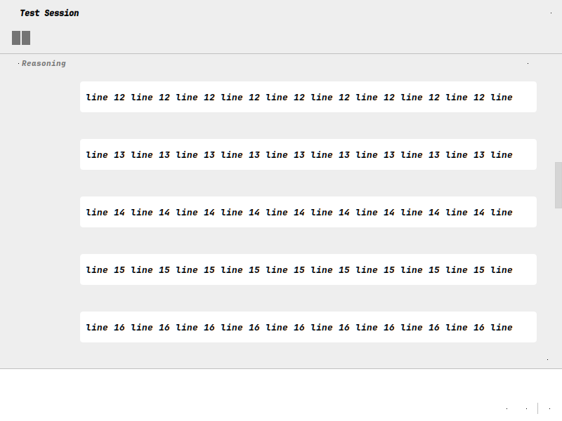

# JetBrains timeline navigation test captures

These images come from an off-screen Swing integration fixture on the fixed build for Kilo-Org/kilocode#14917. They show the state before and after clicking the timeline. They are not manual IDE screenshots. The pre-fix regression failed with scroll position 3045 instead of 908.

| Before click | After click |
|---|---|
|  |  |

The patch has 111 passing targeted tests and passing typecheck. The complete package test command failed with three frontend failures; two also reproduce on the unmodified baseline, and the full-suite ConnectionDelay failure remains unexplained. No manual IDE run or independent human review is claimed. These captures do not establish that the full suite passed.
